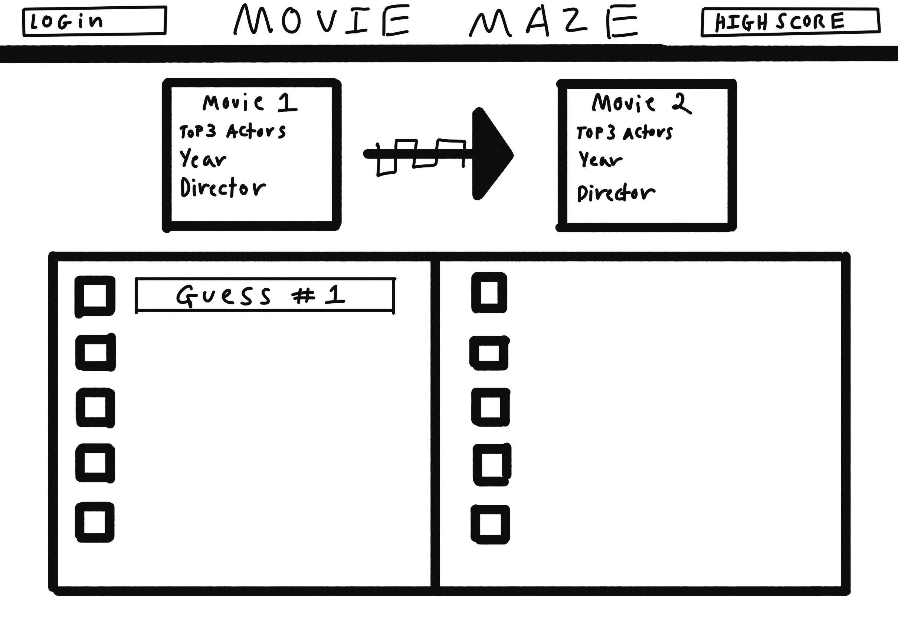

# MovieMaze

[My Notes](notes.md)

MovieMaze is a daily game akin to the wordle, involving connecting two films through commonalities in their year of release, director, or top billed actors. The next film guessed must have one of the three data in common with the previous entry. Players will have 10 films to construct a pathway or route, from the first film to the other. 

> [!NOTE]
> This is a template for your startup application. You must modify this `README.md` file for each phase of your development. You only need to fill in the section for each deliverable when that deliverable is submitted in Canvas. Without completing the section for a deliverable, the TA will not know what to look for when grading your submission. Feel free to add additional information to each deliverable description, but make sure you at least have the list of rubric items and a description of what you did for each item.

> [!NOTE]
> If you are not familiar with Markdown then you should review the [documentation](https://docs.github.com/en/get-started/writing-on-github/getting-started-with-writing-and-formatting-on-github/basic-writing-and-formatting-syntax) before continuing.

### Elevator pitch

Do you love movies and want to prove your cinefile knowledge to your friends and acquaintances? With MovieMaze you and your friends can prove how much you know, solving a new route from film to film each day. A shorter route means more points and a higher spot on the updating leaderboard. If you fail to find a route after 10 films, you're out; try again tomorrow! MovieMaze is a fun, simple, and exciting new take on the daily brainteaser games you know and love, only now with a cinematic twist.

### Design

MovieMaze features a header with the title and options to login as well as view your high score. Below is a display featuring the movie puzzle of the day with the information for the two films. Below that is the Selection square featuring spaces for your 10 film guesses. Upon completion of the puzzle a pop up will appear displaying your score as well as the leaderboard with an option to share your score.

### Key features

- Secure Account that keeps track of high score
- Randomized new film puzzle each day
- Leaderboard displayable upon completion of daily puzzle updated in real time
- Film data from guess displayed upon entry

### Technologies

I am going to use the required technologies in the following ways.

- **HTML** - Simple HTML structure using only one page. The header features options to view your high score as well as login. Also included are a display section for the daily puzzle, a guessing box for your ten guesses, and a pop up that appears upon completion displaying the leaderboard and your high score.
- **CSS** - Page will be made up mostly of simple boxes and whitespace. Will use mostly black and white with green and red to indicate correct or incorrect choices.
- **React** - Utilized for login, accessing leaderboard, imputing guesses, and sharing score upon completion of puzzle. Selecting to view your high score also displays the leaderboard. Patrons will only have the ability to input guesses upon login.
- **Service** - Backend service with endpoints for:
  - Login
  - Checking guesses
  - Retrieving leaderboard
  - Retrieving movie information to select random puzzle and verify guesses from https://www.omdbapi.com/ public API.
- **DB/Login** - Store users, past puzzles, and high scores in the database. Guess making only accessible upon authentication. Past puzzles referenced upon random selection to ensure a different puzzle each day. 
- **WebSocket** - Daily Scores from each player are added to the leaderboard to update ranking in real time.

## 🚀 Specification Deliverable

> [!NOTE]
> Fill in this sections as the submission artifact for this deliverable. You can refer to this [example](https://github.com/webprogramming260/startup-example/blob/main/README.md) for inspiration.

For this deliverable I did the following. I checked the box `[x]` and added a description for things I completed.

- [X] I completed the prerequisites for this deliverable (Git commit requirement)
- [X] Proper use of Markdown
- [X] A concise and compelling elevator pitch
- [X] Description of key features
- [X] Description of how you will use each technology including your 3rd party API and use of WebSocket
- [X] One or more rough sketches of your application. Images must be embedded in this file using Markdown image references.

## 🚀 AWS deliverable

For this deliverable I did the following. I checked the box `[x]` and added a description for things I completed.

- [X] **Rented EC2 server** - I did not complete this part of the deliverable.
- [X] **Leased domain name** - I did not complete this part of the deliverable.
- [X] **Server accessible** from my domain: [https://moviemaze.click](https://moviemaze.click/)

## 🚀 HTML deliverable

For this deliverable I did the following. I checked the box `[x]` and added a description for things I completed.

- [ ] I completed the prerequisites for this deliverable (Simon deployed, GitHub link, Git commits)
- [ ] **HTML pages** - I did not complete this part of the deliverable.
- [ ] **Proper HTML element usage** - I did not complete this part of the deliverable.
- [ ] **Links** - I did not complete this part of the deliverable.
- [ ] **Text** - I did not complete this part of the deliverable.
- [ ] **3rd party API placeholder** - I did not complete this part of the deliverable.
- [ ] **Images** - I did not complete this part of the deliverable.
- [ ] **Login placeholder** - I did not complete this part of the deliverable.
- [ ] **DB data placeholder** - I did not complete this part of the deliverable.
- [ ] **WebSocket placeholder** - I did not complete this part of the deliverable.

## 🚀 CSS deliverable

For this deliverable I did the following. I checked the box `[x]` and added a description for things I completed.

- [ ] I completed the prerequisites for this deliverable (Simon deployed, GitHub link, Git commits)
- [ ] **Visually appealing colors and layout. No overflowing elements.** - I did not complete this part of the deliverable.
- [ ] **Use of a CSS framework** - I did not complete this part of the deliverable.
- [ ] **All visual elements styled using CSS** - I did not complete this part of the deliverable.
- [ ] **Responsive to window resizing using flexbox and/or grid display** - I did not complete this part of the deliverable.
- [ ] **Use of a imported font** - I did not complete this part of the deliverable.
- [ ] **Use of different types of selectors including element, class, ID, and pseudo selectors** - I did not complete this part of the deliverable.

## 🚀 React part 1: Routing deliverable

For this deliverable I did the following. I checked the box `[x]` and added a description for things I completed.

- [ ] I completed the prerequisites for this deliverable (Simon deployed, GitHub link, Git commits)
- [ ] **Bundled using Vite** - I did not complete this part of the deliverable.
- [ ] **Components** - I did not complete this part of the deliverable.
- [ ] **Router** - I did not complete this part of the deliverable.

## 🚀 React part 2: Reactivity deliverable

For this deliverable I did the following. I checked the box `[x]` and added a description for things I completed.

- [ ] I completed the prerequisites for this deliverable (Simon deployed, GitHub link, Git commits)
- [ ] **All functionality implemented or mocked out** - I did not complete this part of the deliverable.
- [ ] **Hooks** - I did not complete this part of the deliverable.

## 🚀 Service deliverable

For this deliverable I did the following. I checked the box `[x]` and added a description for things I completed.

- [ ] I completed the prerequisites for this deliverable (Simon deployed, GitHub link, Git commits)
- [ ] **Node.js/Express HTTP service** - I did not complete this part of the deliverable.
- [ ] **Static middleware for frontend** - I did not complete this part of the deliverable.
- [ ] **Calls to third party endpoints** - I did not complete this part of the deliverable.
- [ ] **Backend service endpoints** - I did not complete this part of the deliverable.
- [ ] **Frontend calls service endpoints** - I did not complete this part of the deliverable.
- [ ] **Supports registration, login, logout, and restricted endpoint** - I did not complete this part of the deliverable.
- [ ] **Uses BCrypt to hash passwords** - I did not complete this part of the deliverable.

## 🚀 DB deliverable

For this deliverable I did the following. I checked the box `[x]` and added a description for things I completed.

- [ ] I completed the prerequisites for this deliverable (Simon deployed, GitHub link, Git commits)
- [ ] **Stores data in MongoDB** - I did not complete this part of the deliverable.
- [ ] **Stores credentials in MongoDB** - I did not complete this part of the deliverable.

## 🚀 WebSocket deliverable

For this deliverable I did the following. I checked the box `[x]` and added a description for things I completed.

- [ ] I completed the prerequisites for this deliverable (Simon deployed, GitHub link, Git commits)
- [ ] **Backend listens for WebSocket connection** - I did not complete this part of the deliverable.
- [ ] **Frontend makes WebSocket connection** - I did not complete this part of the deliverable.
- [ ] **Data sent over WebSocket connection** - I did not complete this part of the deliverable.
- [ ] **WebSocket data displayed** - I did not complete this part of the deliverable.
- [ ] **Application is fully functional** - I did not complete this part of the deliverable.
